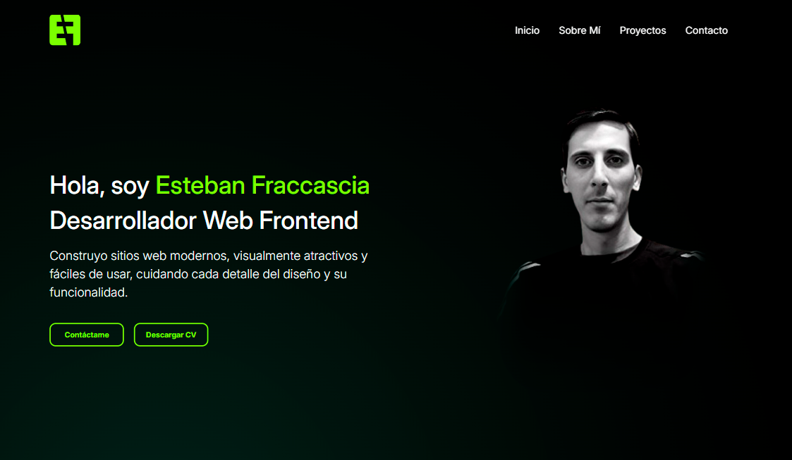

# PROYECTO CODERHOUSE PORTFOLIO PERSONAL

# Entrega 3 – Desarrollo Web Avanzado

Sitio Web Responsive con SASS y Maquetado Web

📋 Descripción
Este proyecto consiste en el desarrollo de un sitio web completamente maquetado y estilizado, utilizando tecnologías modernas como HTML5, CSS3 con preprocesador SASS, y un sistema de grillas (ya sea Bootstrap o Flexbox + Grid). El objetivo es lograr una experiencia responsive y optimizada tanto para mobile como para desktop.

🎯 Objetivos del Proyecto
Desarrollar la estructura final de la web con HTML semántico y ordenado.

Aplicar un estilo visual final, coherente y funcional.

Implementar SASS correctamente, usando nesting, variables, mixins, extend y operadores.

Subir el proyecto a un repositorio GitHub siguiendo buenas prácticas de versionado.

🧩 Requisitos Técnicos

1. Estructura HTML
   HTML prolijo, semántico y bien indentado.

Uso adecuado de etiquetas como <header>, <section>, <article>, <footer>, etc.

Implementación de sistema de grillas (Bootstrap o Flexbox + Grid).

Inclusión de librerías pertinentes (JS/CSS).

Contenido linkeado correctamente y navegación funcional.

Separación en uno o más archivos .html según necesidad del proyecto.

2. Archivos CSS y SCSS
   Conversión total del código CSS a SCSS.

Uso de:

Nesting

Mixins reutilizables

Variables globales

Extend y operadores

Aplicación de:

Transiciones

Animaciones

Transformaciones visuales

Arquitectura modular de carpetas para SCSS (base/, components/, layout/, etc).

3. Git y GitHub
   Repositorio público con todos los archivos del proyecto.

.gitignore configurado (ej. para excluir node_modules/).

Historial de commits limpio y descriptivo.

URL del repositorio compartida.

📱 Responsive Design
Diseño adaptable a diferentes resoluciones: mobile, tablet, desktop.

Uso de media queries con unidades relativas (em, %, rem, vw/vh).

Navegación fluida e intuitiva.

💡 Recomendaciones Aplicadas
Optimización de rendimiento (compresión, organización del código).

Control de versiones con ramas y commits claros.

Pruebas en distintos navegadores y dispositivos.

Buenas prácticas SCSS: código DRY, modularización, consistencia visual.

✅ Criterios de Evaluación Cubiertos
✔️ Estructura semántica y ordenada en HTML.

✔️ Estilo coherente y paleta de colores consistente.

✔️ Código SCSS reutilizable y bien estructurado.

✔️ Implementación de Flexbox/Grid con criterio.

✔️ Navegación funcional e intuitiva.

✔️ Responsividad lograda mediante media queries.

✔️ Repositorio con historial de versiones claro.
